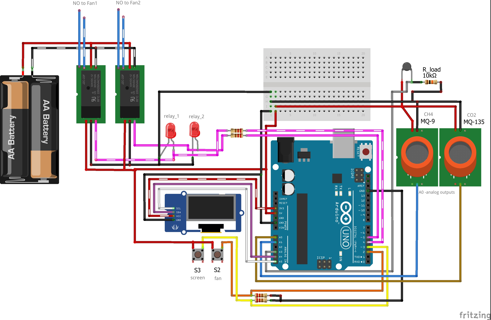

# This is a Home/Flat ventilation system.
For measuring rooms air quality it uses two gas sensors MQ-9 and MQ-135 also a Thermistor for measuring temperature.
Displays gas value (unitless) and temperature (celsius) on a I2C 128x32 SSD1306 driver OLED display.
Has a two buttons:
	first button -- Toggles ON/OFF the display
	second button -- Turns on the fans for a period of time

------
Circuit:

## What it does?
* Automatically turns the fans ON, when the air quality goes bad (user inputs the values)
* User can turn the fans for a period of time, the remaining time is displayed on the LCD
* Toggle ON/OFF the display -- Why should it run always.

*watch a demo video below:*

[Demo video link](https://youtu.be/hbuPtd6k3tc)
*only one sensor in demo* :(

### Technologies used:
* For measuring temperature with a Thermistor, Steinhart–Hart equation was used
* for the OLED display [u8x8 library](https://github.com/olikraus/u8g2/wiki/u8x8reference) was used
