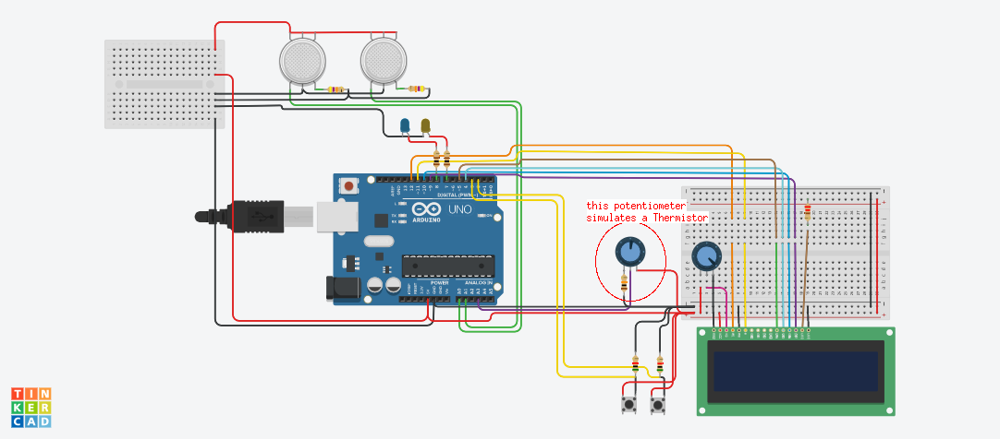

# Circuit schematics info:
Production version schematic:

Simulation version schematic:

..Simulations where made in [Tinkercad](https://www.tinkercad.com)..
..When simulating used a potentiometer instead of the NTC thermistor, set potentiometers resistance to 10kOhm (because NTC-MF52-103 resistance is 10kOhm) also set the load resistor to 10kOhm. ..
Code for simulation is in *__asserts/other versions/main_v2-Steinhart.cpp__*
Or just test how it measures the temperature: *__asserts/other versions/test-Steinhart.cpp__*

## Bill of Materials:
1) 128x32 I2C SSD1306 OLED display

2) NTC MF52 series 103 type 10K ohm 1% Thermistor

3) 10K Ohm resistor (Thermistors load resistance)

4) MQ-9 Gas sensor

5) MQ-135 Gas sensor

6) 2x Momentary buttons
7) 2x resistors for those buttons
8) 2x LED (for indication)
9) 2x resistors for those LEDS (remember R = (U-U_led)/I, for a white/blue LED R=(5-3)/0.02)
10) Arduino UNO R3 or Atmega328P
