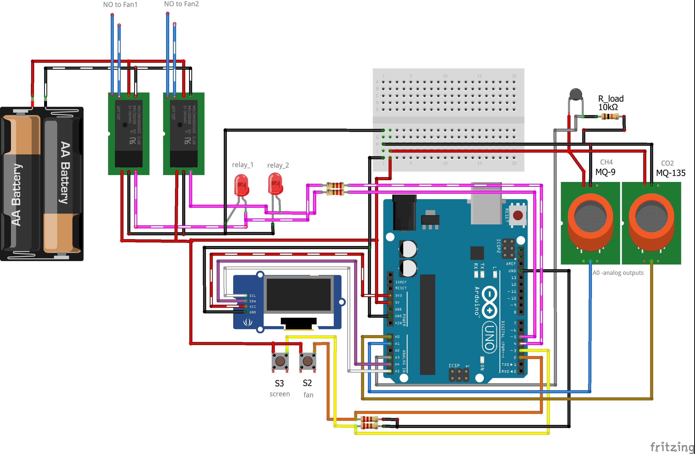
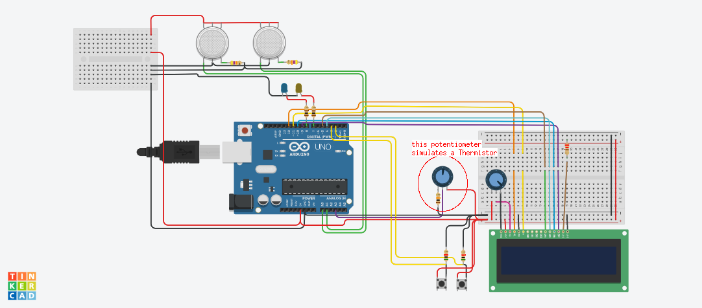

#Circuit schematics info:
------
Production version schematic:

------
Simulation version schematic:

..Simulations where made in [Tinkercad](https://www.tinkercad.com)..
..When simulating used a potentiometer instead of the NTC thermistor, set potentiometers resistance to 10kOhm (because NTC-MF52-103 resistance is 10kOhm) also set the load resistor to 10kOhm. ..
Code for simulation is in *__asserts/other versions/main_v2-Steinhart.cpp__*
Or just test how it measures the temperature: *__asserts/other versions/test-Steinhart.cpp__*
